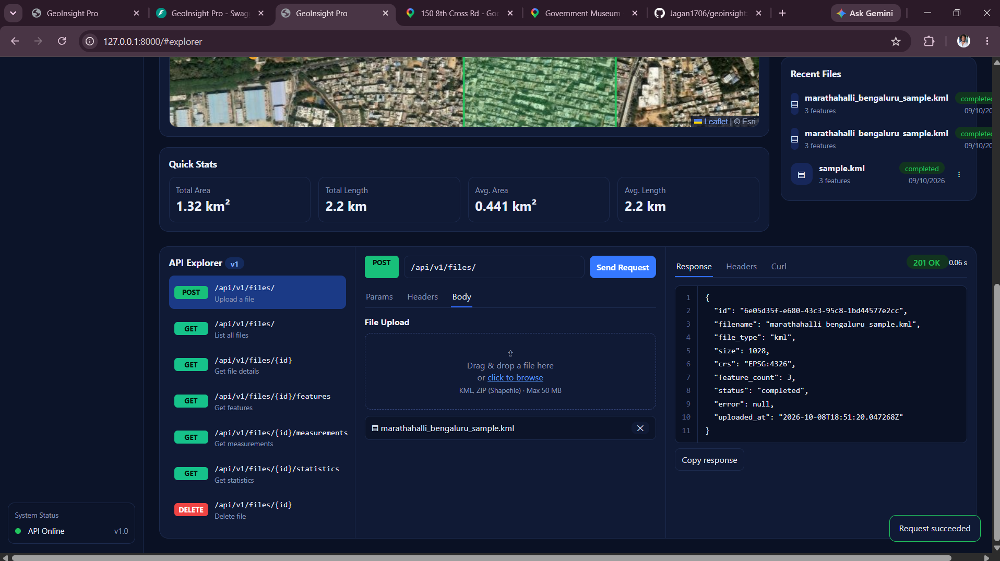
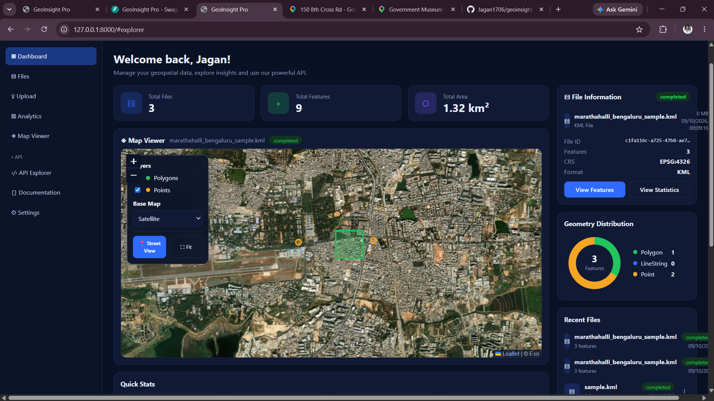
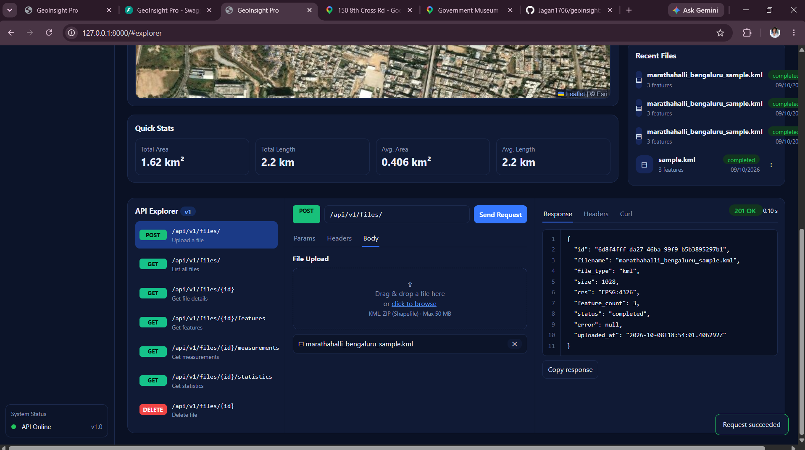
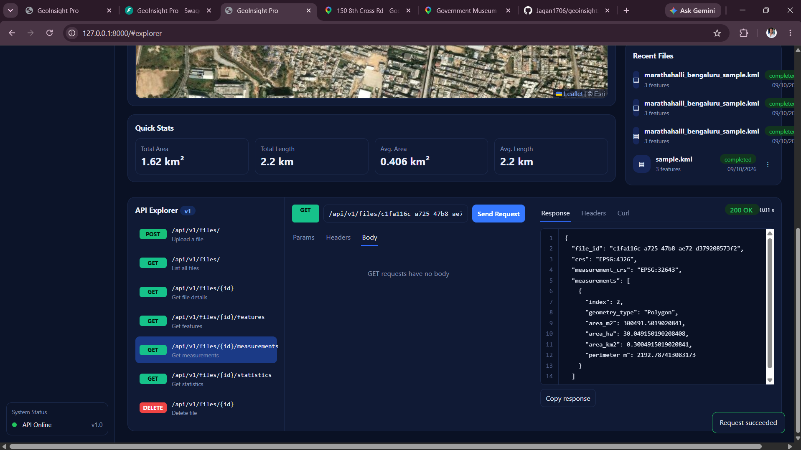
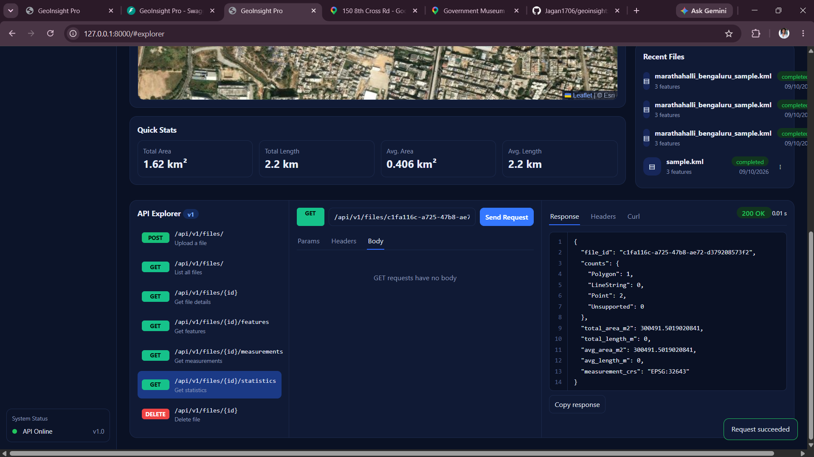

# GeoInsight

**A Web-Based Geospatial Data Analysis and Visualization Application**

GeoInsight is a web application for uploading, analyzing, and visualizing geospatial data in KML and Shapefile formats. It provides an interactive map interface, geographic measurements, file statistics, and REST API access.

## Overview

GeoInsight enables users to upload geographic files, explore spatial features, inspect coordinate reference system (CRS) information, and analyze geographic data through an interactive web interface. The application combines a Python-based backend with a map-based frontend to make geospatial data easier to explore.

## Features

- **Geospatial File Upload** — Upload KML files and zipped Shapefiles.
- **Interactive Map Visualization** — View geographic features on an interactive map.
- **Geographic Feature Analysis** — Explore features and geometry types.
- **Coordinate Reference System (CRS)** — Inspect spatial reference information.
- **Geographic Measurements** — Access area and length measurements.
- **File Statistics** — Retrieve statistics for uploaded datasets.
- **Multiple File Support** — Work with multiple uploaded files.
- **REST API Integration** — Access geospatial functionality through API endpoints.
- **Interactive API Documentation** — Explore API operations using FastAPI documentation.
- **Street View Integration** — Open Google Maps or Street View for geographic exploration.
- **Dashboard** — View information about uploaded files.

## Technology Stack

| Category | Technologies |
|---|---|
| Backend | Python, FastAPI, Uvicorn |
| Geospatial Processing | GeoPandas |
| Database Toolkit | SQLAlchemy |
| Frontend | HTML, CSS, JavaScript |
| Map Visualization | Leaflet |
| API Documentation | FastAPI / OpenAPI |

## Project Structure

```text
geoinsight/
├── backend/
├── frontend/
├── Screenshots/
│   ├── api-explorer.png
│   ├── dashboard.png
│   ├── file-upload.png
│   ├── map-viewer.png
│   ├── measurements.png
│   ├── statistics.png
│   └── street-view.png
├── README.md
└── .gitignore
```

## Application Screenshots

### Dashboard


### File Upload



### Interactive Map Viewer



### API Explorer



### Geographic Measurements



### File Statistics



### Street View Integration


## Getting Started

### Prerequisites

- Windows or another supported operating system
- Python installed in a suitable environment
- Project dependencies installed

### Run the Backend

From the project root, navigate to the backend directory:

```powershell
cd backend
```

Start the FastAPI application using Uvicorn:

```powershell
python -m uvicorn app.main:app --reload
```

Open the application in your browser:

- **Web Application:** http://127.0.0.1:8000/
- **API Documentation:** http://127.0.0.1:8000/docs
- **OpenAPI Specification:** http://127.0.0.1:8000/openapi.json

> If you use the existing Conda environment on your Windows computer, activate it or use its Python executable to start the server.

## API Endpoints

The application includes the following API endpoints, subject to the current backend implementation:

| Method | Endpoint | Description |
|---|---|---|
| GET | `/api/v1/files/` | List uploaded files |
| POST | `/api/v1/files/` | Upload a geospatial file |
| GET | `/api/v1/files/{id}` | Retrieve file information |
| GET | `/api/v1/files/{id}/features` | Retrieve geographic features |
| GET | `/api/v1/files/{id}/measurements` | Retrieve geographic measurements |
| GET | `/api/v1/files/{id}/statistics` | Retrieve file statistics |
| DELETE | `/api/v1/files/{id}` | Delete an uploaded file |

## Use Cases

- Exploring geographic datasets.
- Visualizing spatial features on an interactive map.
- Inspecting geospatial file properties and coordinate reference systems.
- Reviewing geographic measurements and dataset statistics.
- Accessing geospatial functionality through REST APIs.

## Future Enhancements

- Additional geospatial file format support.
- Advanced spatial analysis tools.
- Export options for processed datasets.
- Enhanced visualization and filtering capabilities.
- Deployment to a publicly accessible hosting platform.

## Author

**Jagan PM**

## Repository

[GeoInsight on GitHub](https://github.com/Jagan1706/geoinsight)

---

*GeoInsight — Explore, analyze, and visualize geospatial data.*
