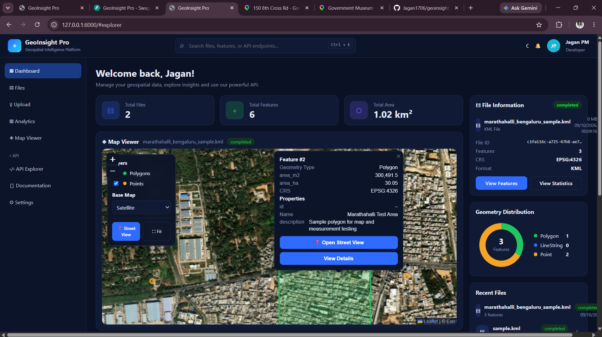

# GeoInsight

Web-based geospatial data analysis and visualization application for working with KML and Shapefile data.

## Overview

GeoInsight provides a web interface for uploading and analyzing geospatial data. The application extracts geographic features and displays them on an interactive map, while providing measurements, file statistics, and REST API access.

## Features

- Upload KML and zipped Shapefile data
- Interactive map visualization
- Geographic feature and geometry type analysis
- Coordinate Reference System (CRS) information
- Area and length measurements
- File statistics
- Multiple file support
- REST API integration
- Interactive API documentation with FastAPI
- Street View integration
- Dashboard for uploaded file information

## Technology Stack

- Python
- FastAPI
- GeoPandas
- SQLAlchemy
- Leaflet
- HTML
- CSS
- JavaScript
- Uvicorn

## Project Structure

```text
geoinsight/
├── backend/
├── frontend/
├── screenshots/
├── README.md
└── .gitignore

## Application Screenshots
## Dashboard

